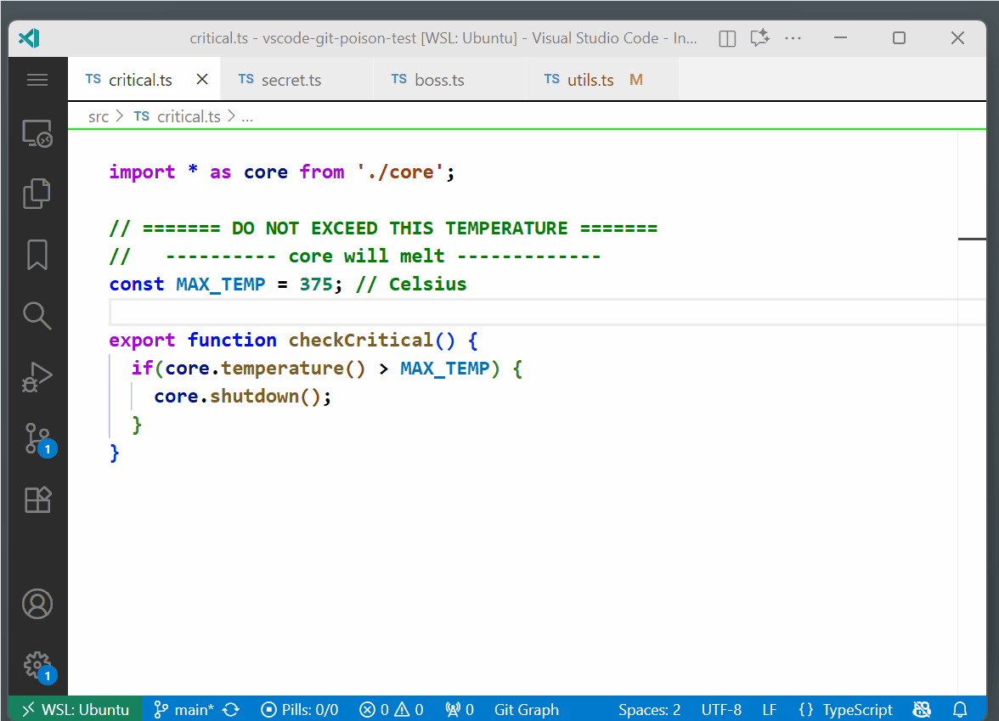

### Overview

Git Poison is a VS Code extension that blocks a git commit of any file containing a \"Poison Pill\" string. Placing a pill stops accidental committing of unfinished TODOs, debug statements, secrets, etc. It also provides navigation to pill locations.

### Fast

All scans use the Git Grep so this is as fast as normal Git operations

### Secure

The code to block commits is inside Git at `.git/hooks/pre-commit`.  This means that poison pills are blocked no matter where the git commit is run.  It works in VS Code, external terminals, Git GUI apps, etc. It even works when no VS Code window is running.

### Status Bar

The status bar option show S/A where S is the number of pills in staged files.  If S is greater than zero then committing will be blocked.  A is the number of pils in the entire workspace.  Clicking on this status cause a Full Scan to be done.

### Commands

- *Insert Poison Pill*: Paste the poison pill text at selection.  You can aslo just type the text instead. Default key is *ctrl-alt-+*.

- *View Next Pill*: Jump to the next pill and show it. It jumps through all files in the workspace. Default key is *ctrl-alt-)*.

- *View Previous Pill*: Jump to the previous pill and show it. Default key is *ctrl-alt(*.

- *Override Commit Blocking*: For 30 seconds committing pills is allowed. This might be useful for temporary commits of a development branch. Default key is *ctrl-alt--*.

- *Incremental Refresh*: Rebuild index of changed files. This should never be needed.  There is no default key.

- *Scan All Files*: Rebuild index of all files in the workspace. This should never be needed. There is no default key.

### Settings

- *Poison Pill String*: The text string of a poison pill. This will be inserted by the \"Insert Pill\" command and be used to detect pills. Warning: If you don't remove old pills before changing this setting, you may accidentally commit them. Default is "//❌".

- *Override Blocking Timeout (Seconds)*: Number of seconds after the override blocking command is executed that blocking will be disabled. After this time, the blocking will be re-enabled. Default is 30 seconds.

- *Show Status Bar*: Show a status bar item with pill counts in staged files and total number of pills. If staged count is greater than zero then committing is blocked. The total number may be low when scanning is needed.  Default is true.

- *Folders/Files to Exclude*: Glob patterns to exclude from scanning. Use brace expansion syntax like {folder1,folder2} for multiple folders. Comma-separated patterns are not supported - use brace expansion instead. Default is "&#42;&#42;&#47;{.git,node_modules,dist,build,.cache,out,tmp,temp,coverage}&#47;&#42;&#42;".

#### Author: Mark Hahn (eridien)

#### Marketplace: https://marketplace.visualstudio.com/items?itemName=eridien.vscode-git-poison

#### Open VSX: https://open-vsx.org/extension/eridien/vscode-git-poison

#### Repo: https://github.com/eridien/vscode-git-poison

#### Original Release: September 2025

#### License: MIT
